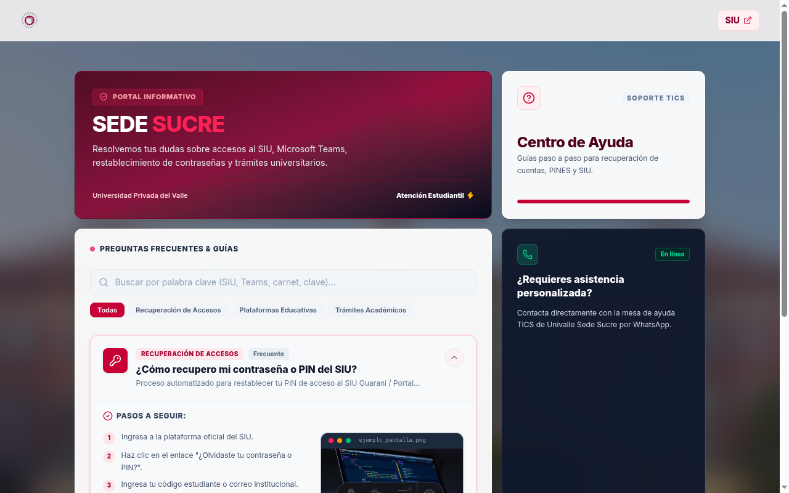
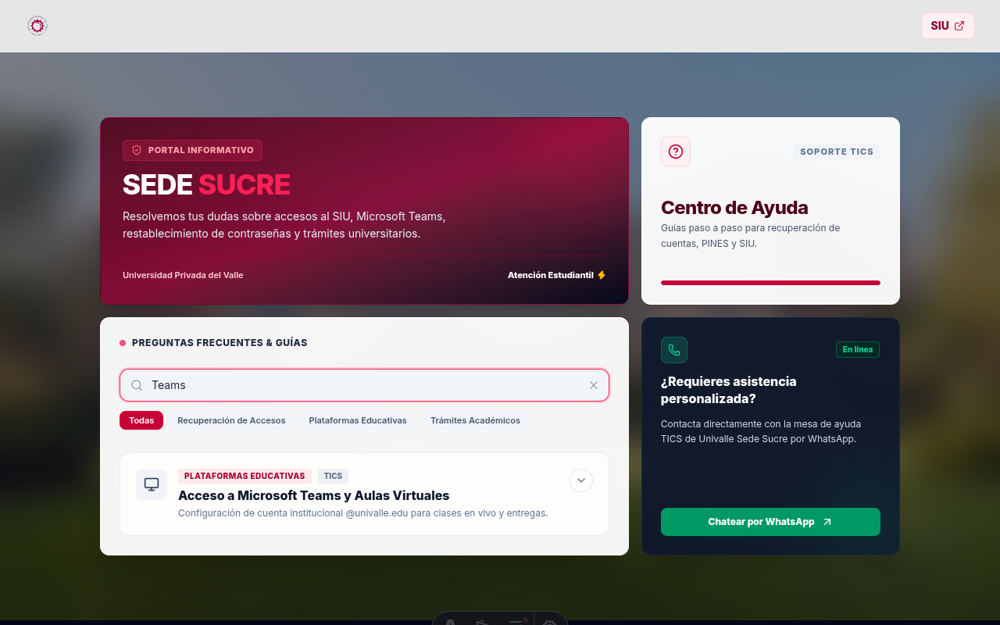
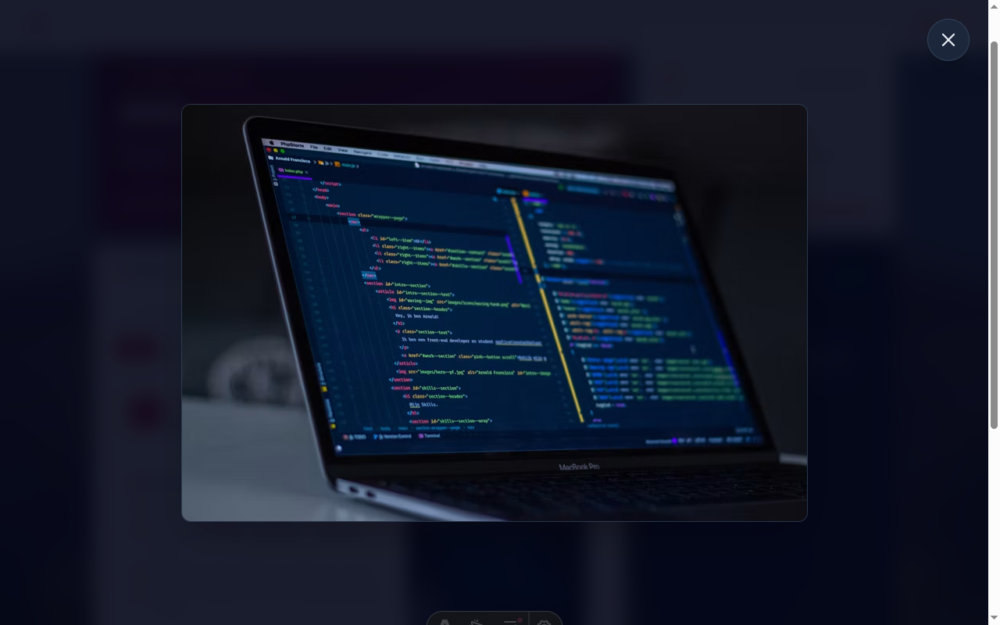
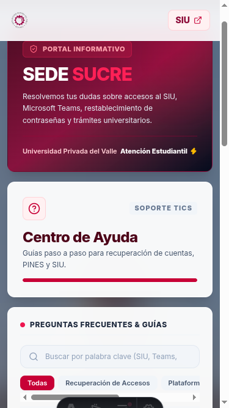

<div align="center">

# 🎓 Univalle Sucre - Centro de Ayuda Estudiantil

<p align="center">
  <b>Portal web interactivo de preguntas frecuentes y soporte para la comunidad universitaria de Univalle (Sede Sucre).</b>
</p>

<p align="center">
  
  
  
  
  
</p>

</div>

---

## 📌 Descripción

**Univalle Sucre - Centro de Ayuda Estudiantil** es una plataforma moderna desarrollada con **Astro 5/7**, **React 19** y **Tailwind CSS v4**. Está diseñada para brindar acceso rápido a guías de recuperación de accesos (SIU, Microsoft Teams), credenciales digitales y trámites académicos con una experiencia fluida, rápida y accesible.

---

## ✨ Características Principales

- 🍱 **Diseño Bento Grid**: Estructura visual moderna en formato rejilla Bento con acabados *dark glassmorphism* y gradientes sutiles.
- 🏝️ **Arquitectura de Islas (Astro Islands)**: Componentes estáticos entregados como HTML de alto rendimiento (0kB de JS) e islas interactivas de React hidratadas bajo demanda.
- 🔎 **Búsqueda Instantánea & Filtros**: Buscador por palabra clave en tiempo real y chips de filtro por categoría (*"Accesos"*, *"Plataformas"*, *"Trámites"*).
- 💬 **Soporte Directo por WhatsApp**: Integración directa con el canal de atención rápida de la mesa de ayuda TICS de la Sede Sucre.
- ♿ **Accesibilidad & Teclado (WCAG AA)**: Atributos ARIA completos (`aria-expanded`, `aria-controls`), navegación por teclado y soporte para tecla `Escape` en modales.
- ⚡ **Loader Ultrarrápido (`400ms`)**: Tiempo de carga percibido optimizado con transiciones de entrada suaves.
- 🖼️ **Optimización de Assets (`astro:assets`)**: Procesamiento y compresión automática de imágenes a formato WebP.
- 🎨 **Tipografía Autohospedada**: Integración de `@fontsource/inter` para eliminar llamadas externas bloquantes a Google Fonts.

---

## 📸 Demostración Visual de Funcionalidades

### 1. Vista Principal (Bento Grid Layout)
> Interfaz principal responsiva estructurada con rejilla Bento en acabado *glassmorphism*, encabezado optimizado con `astro:assets` y tarjeta de acceso directo a la mesa de ayuda por WhatsApp.



---

### 2. Búsqueda Instantánea y Filtros por Categoría
> Filtrado interactivo en tiempo real por término de búsqueda (ej. *"Teams"*, *"SIU"*, *"carnet"*) o mediante chips de categoría (*"Recuperación de Accesos"*, *"Plataformas Educativas"*, *"Trámites Académicos"*).



---

### 3. Visor Lightbox de Capturas en Pantalla Completa
> Modal de alta resolución aislado mediante **React Portal (`createPortal`)** que cubre el 100% de la pantalla sin interferencias de contenedores padres, con soporte para tecla `Escape` y botón flotante de cierre `(X)`.



---

### 4. Diseño Responsivo Móvil
> Adaptación nativa a pantallas pequeñas (smartphones y tablets) con navegación táctil fluida y menús comprimidos.



---

## 🛠️ Tecnologías Utilizadas

| Categoría | Tecnología / Librería | Descripción |
| :--- | :--- | :--- |
| **Core Framework** | [Astro v5/v7](https://astro.build/) | Generador estático de alto rendimiento (*Islands Architecture*) |
| **UI Library** | [React v19](https://react.dev/) | Biblioteca de interfaz para componentes dinámicos |
| **Styling** | [Tailwind CSS v4](https://tailwindcss.com/) | Framework de CSS utilitario con integración Vite plugin |
| **Animaciones** | [Framer Motion](https://www.framer.com/motion/) | Transiciones fluidas y micro-interacciones |
| **Iconografía** | [Lucide React](https://lucide.dev/) | Iconos vectoriales limpios y accesibles |
| **Fuentes** | `@fontsource/inter` | Fuente Inter autohospedada de alto rendimiento |
| **Lenguaje** | TypeScript | Tipado estricto con `astro/tsconfigs/strict` |

---

## 📁 Estructura del Proyecto

```text
minimalist/
├── docs/
│   └── screenshots/          # Capturas de pantalla tomadas por Playwright MCP
│       ├── bento-grid.png
│       ├── search-filter.png
│       ├── modal-lightbox.png
│       └── mobile-view.png
├── public/
│   ├── favicon.svg
│   └── logo.png
├── src/
│   ├── assets/
│   │   └── logo.png           # Assets procesados por astro:assets
│   ├── components/
│   │   ├── BentoFAQ.jsx        # Layout Bento Grid interactivo
│   │   ├── FAQAccordion.jsx   # Acordeón de preguntas frecuentes con React Portal
│   │   ├── Header.astro       # Encabezado estático optimizado
│   │   └── PageLoader.jsx     # Loader de pantalla completo
│   ├── layouts/
│   │   └── Layout.astro       # Layout base con SEO & Open Graph
│   ├── pages/
│   │   └── index.astro        # Página principal
│   └── styles/
│       └── global.css         # Estilos globales y configuración Tailwind v4 @theme
├── astro.config.mjs           # Configuración de Astro & Plugins (React + Tailwind Vite)
├── package.json               # Dependencias del proyecto
├── tsconfig.json              # Configuración TypeScript con Path Aliases (@components/*)
└── README.md
```

---

## 🚀 Instalación y Uso Local

### Prerrequisitos
- Node.js `>= 22.12.0`
- npm `>= 10.0.0`

### Pasos para Ejecutar

1. **Clonar el repositorio:**
   ```bash
   git clone https://github.com/danielmoya98/univalle-astro-minimalist.git
   cd univalle-astro-minimalist
   ```

2. **Instalar dependencias:**
   ```bash
   npm install
   ```

3. **Iniciar el servidor de desarrollo:**
   ```bash
   npm run dev
   ```
   Abre [http://localhost:4321](http://localhost:4321) en tu navegador.

4. **Compilar para producción:**
   ```bash
   npm run build
   ```

5. **Previsualizar la build:**
   ```bash
   npm run preview
   ```

---

## 🌿 Flujo de Trabajo Git-Flow

Este repositorio sigue la metodología **Git-Flow**:

- `main`: Rama de producción estable.
- `develop`: Rama principal de integración y desarrollo.
- `feature/*`: Ramas secundarias para desarrollo de nuevas funcionalidades.

---

## 👤 Autor

Desarrollado por **Daniel Moya** ([@danielmoya98](https://github.com/danielmoya98)).

---

## 📄 Licencia

Este proyecto está bajo la Licencia **MIT**. Consulta el archivo `LICENSE` para más información.
